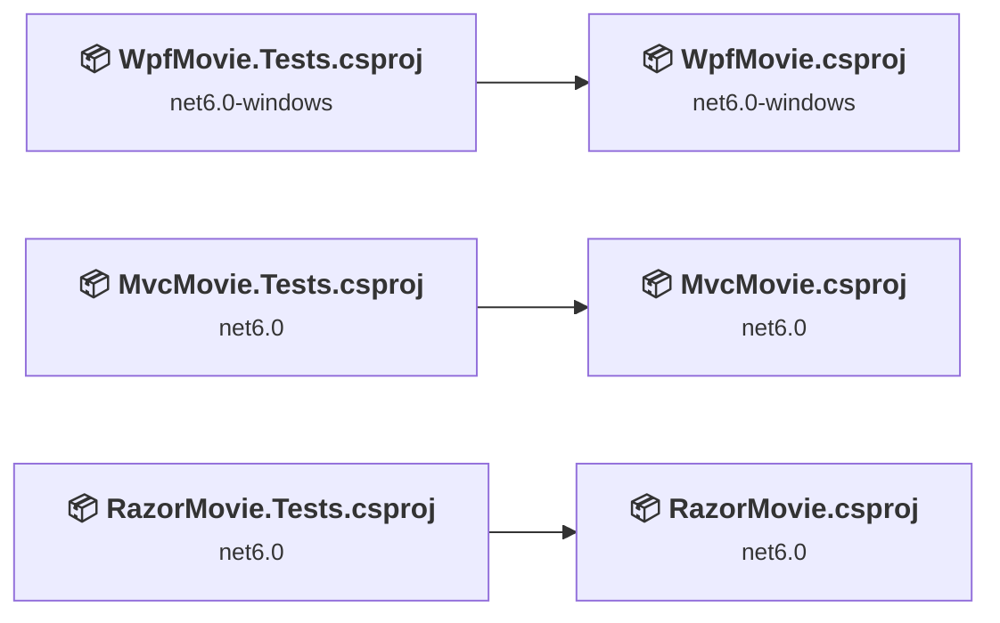
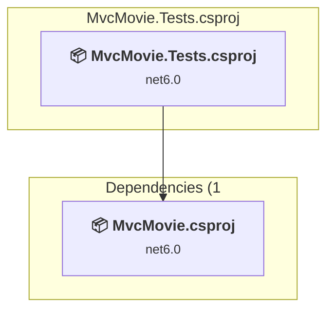
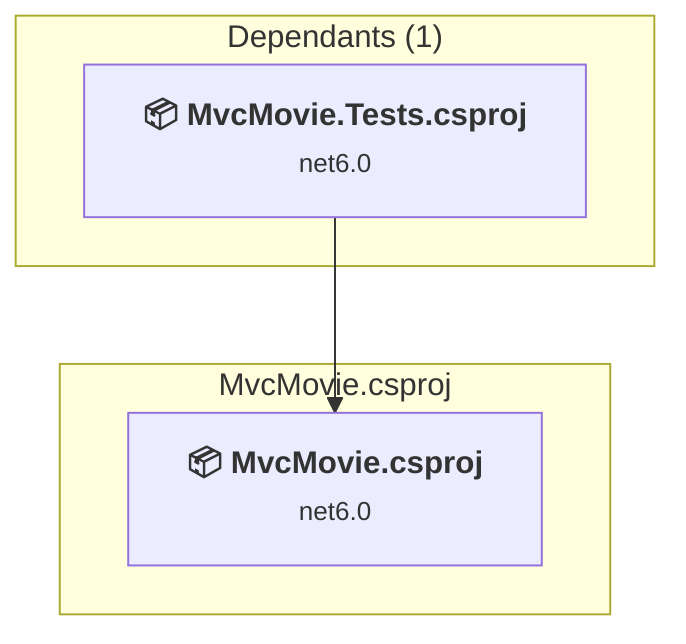
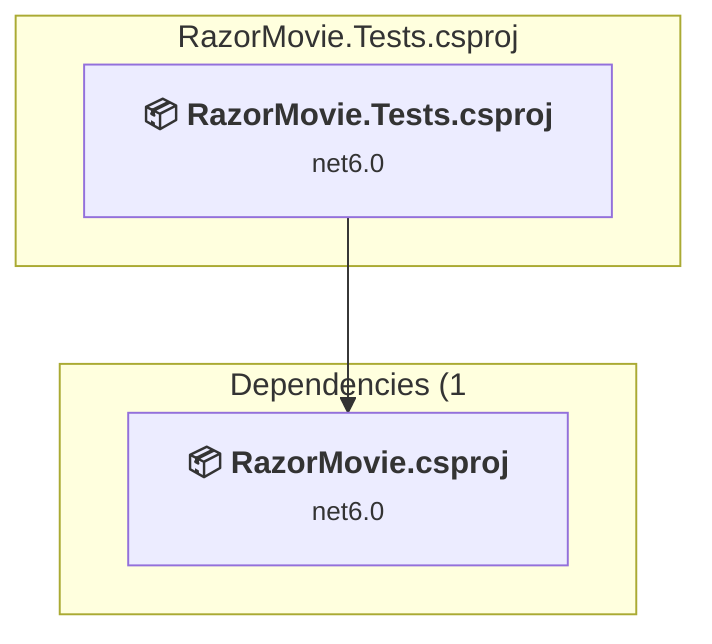
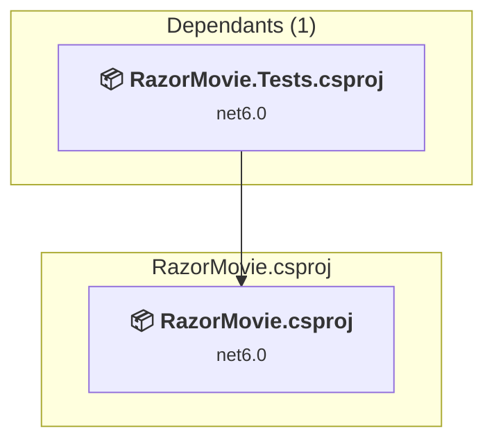
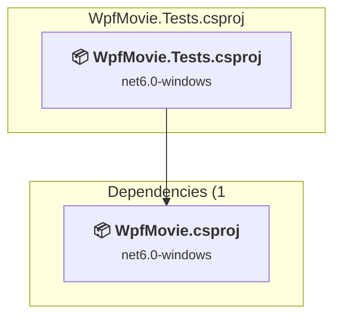
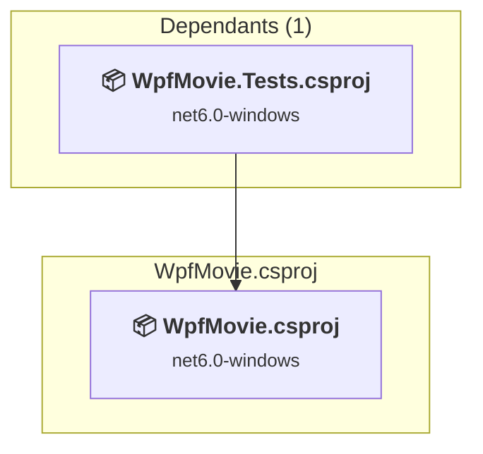

# Projects and dependencies analysis

This document provides a comprehensive overview of the projects and their dependencies in the context of upgrading to .NETCoreApp,Version=v10.0.

## Table of Contents

- [Executive Summary](#executive-Summary)
  - [Highlevel Metrics](#highlevel-metrics)
  - [Projects Compatibility](#projects-compatibility)
  - [Package Compatibility](#package-compatibility)
  - [API Compatibility](#api-compatibility)
- [Aggregate NuGet packages details](#aggregate-nuget-packages-details)
- [Top API Migration Challenges](#top-api-migration-challenges)
  - [Technologies and Features](#technologies-and-features)
  - [Most Frequent API Issues](#most-frequent-api-issues)
- [Projects Relationship Graph](#projects-relationship-graph)
- [Project Details](#project-details)

  - [MvcMovie.Tests\MvcMovie.Tests.csproj](#mvcmovietestsmvcmovietestscsproj)
  - [MvcMovie\MvcMovie.csproj](#mvcmoviemvcmoviecsproj)
  - [RazorMovie.Tests\RazorMovie.Tests.csproj](#razormovietestsrazormovietestscsproj)
  - [RazorMovie\RazorMovie.csproj](#razormovierazormoviecsproj)
  - [WpfMovie.Tests\WpfMovie.Tests.csproj](#wpfmovietestswpfmovietestscsproj)
  - [WpfMovie\WpfMovie.csproj](#wpfmoviewpfmoviecsproj)

## Executive Summary

### Highlevel Metrics

| Metric | Count | Status |
| :--- | :---: | :--- |
| Total Projects | 6 | All require upgrade |
| Total NuGet Packages | 17 | 7 need upgrade |
| Total Code Files | 55 |  |
| Total Code Files with Incidents | 13 |  |
| Total Lines of Code | 1914 |  |
| Total Number of Issues | 66 |  |
| Estimated LOC to modify | 53+ | at least 2.8% of codebase |

### Projects Compatibility

| Project | Target Framework | Difficulty | Package Issues | API Issues | Est. LOC Impact | Description |
| :--- | :---: | :---: | :---: | :---: | :---: | :--- |
| [MvcMovie.Tests\MvcMovie.Tests.csproj](#mvcmovietestsmvcmovietestscsproj) | net6.0 | 🟢 Low | 0 | 0 |  | DotNetCoreApp, Sdk Style = True |
| [MvcMovie\MvcMovie.csproj](#mvcmoviemvcmoviecsproj) | net6.0 | 🟢 Low | 5 | 1 | 1+ | AspNetCore, Sdk Style = True |
| [RazorMovie.Tests\RazorMovie.Tests.csproj](#razormovietestsrazormovietestscsproj) | net6.0 | 🟢 Low | 0 | 0 |  | DotNetCoreApp, Sdk Style = True |
| [RazorMovie\RazorMovie.csproj](#razormovierazormoviecsproj) | net6.0 | 🟢 Low | 1 | 1 | 1+ | AspNetCore, Sdk Style = True |
| [WpfMovie.Tests\WpfMovie.Tests.csproj](#wpfmovietestswpfmovietestscsproj) | net6.0-windows | 🟢 Low | 0 | 0 |  | DotNetCoreApp, Sdk Style = True |
| [WpfMovie\WpfMovie.csproj](#wpfmoviewpfmoviecsproj) | net6.0-windows | 🟡 Medium | 1 | 51 | 51+ | Wpf, Sdk Style = True |

### Package Compatibility

| Status | Count | Percentage |
| :--- | :---: | :---: |
| ✅ Compatible | 10 | 58.8% |
| ⚠️ Incompatible | 1 | 5.9% |
| 🔄 Upgrade Recommended | 6 | 35.3% |
| ***Total NuGet Packages*** | ***17*** | ***100%*** |

### API Compatibility

| Category | Count | Impact |
| :--- | :---: | :--- |
| 🔴 Binary Incompatible | 44 | High - Require code changes |
| 🟡 Source Incompatible | 2 | Medium - Needs re-compilation and potential conflicting API error fixing |
| 🔵 Behavioral change | 7 | Low - Behavioral changes that may require testing at runtime |
| ✅ Compatible | 6824 |  |
| ***Total APIs Analyzed*** | ***6877*** |  |

## Aggregate NuGet packages details

| Package | Current Version | Suggested Version | Projects | Description |
| :--- | :---: | :---: | :--- | :--- |
| AspNetCoreRateLimit | 5.0.0 |  | [RazorMovie.csproj](#razormovierazormoviecsproj) | ✅Compatible |
| coverlet.collector | 3.1.2 |  | [MvcMovie.Tests.csproj](#mvcmovietestsmvcmovietestscsproj) [WpfMovie.Tests.csproj](#wpfmovietestswpfmovietestscsproj) | ✅Compatible |
| DequeNET | 1.0.2 |  | [MvcMovie.csproj](#mvcmoviemvcmoviecsproj) | ✅Compatible |
| HtmlSanitizer | 7.1.542 | 9.0.889 | [RazorMovie.csproj](#razormovierazormoviecsproj) | NuGet package contains security vulnerability |
| Microsoft.Data.SqlClient | 4.0.5 |  | [MvcMovie.csproj](#mvcmoviemvcmoviecsproj) | ⚠️NuGet package is deprecated |
| Microsoft.EntityFrameworkCore.Design | 6.0.0-rtm.21467.1 | 10.0.2 | [MvcMovie.csproj](#mvcmoviemvcmoviecsproj) | NuGet package upgrade is recommended |
| Microsoft.EntityFrameworkCore.SqlServer | 6.0.0-rc.1.21452.10 | 10.0.2 | [MvcMovie.csproj](#mvcmoviemvcmoviecsproj) | NuGet package upgrade is recommended |
| Microsoft.EntityFrameworkCore.Tools | 6.0.0-rc.1.21452.10 | 10.0.2 | [MvcMovie.csproj](#mvcmoviemvcmoviecsproj) | NuGet package upgrade is recommended |
| Microsoft.NET.Test.Sdk | 17.1.0 |  | [MvcMovie.Tests.csproj](#mvcmovietestsmvcmovietestscsproj) [WpfMovie.Tests.csproj](#wpfmovietestswpfmovietestscsproj) | ✅Compatible |
| Microsoft.NET.Test.Sdk | 17.12.0 |  | [RazorMovie.Tests.csproj](#razormovietestsrazormovietestscsproj) | ✅Compatible |
| Microsoft.VisualStudio.Web.CodeGeneration.Design | 6.0.0-rc.1.21464.1 | 10.0.2 | [MvcMovie.csproj](#mvcmoviemvcmoviecsproj) | NuGet package upgrade is recommended |
| Moq | 4.18.2 |  | [RazorMovie.Tests.csproj](#razormovietestsrazormovietestscsproj) | ✅Compatible |
| MSTest | 3.6.4 |  | [RazorMovie.Tests.csproj](#razormovietestsrazormovietestscsproj) | ✅Compatible |
| Newtonsoft.Json | 13.0.3 | 13.0.4 | [WpfMovie.csproj](#wpfmoviewpfmoviecsproj) | NuGet package upgrade is recommended |
| NUnit | 3.13.3 |  | [MvcMovie.Tests.csproj](#mvcmovietestsmvcmovietestscsproj) [WpfMovie.Tests.csproj](#wpfmovietestswpfmovietestscsproj) | ✅Compatible |
| NUnit.Analyzers | 3.3.0 |  | [MvcMovie.Tests.csproj](#mvcmovietestsmvcmovietestscsproj) [WpfMovie.Tests.csproj](#wpfmovietestswpfmovietestscsproj) | ✅Compatible |
| NUnit3TestAdapter | 4.2.1 |  | [MvcMovie.Tests.csproj](#mvcmovietestsmvcmovietestscsproj) [WpfMovie.Tests.csproj](#wpfmovietestswpfmovietestscsproj) | ✅Compatible |

## Top API Migration Challenges

### Technologies and Features

| Technology | Issues | Percentage | Migration Path |
| :--- | :---: | :---: | :--- |
| WPF (Windows Presentation Foundation) | 28 | 52.8% | WPF APIs for building Windows desktop applications with XAML-based UI that are available in .NET on Windows. WPF provides rich desktop UI capabilities with data binding and styling. Enable Windows Desktop support: Option 1 (Recommended): Target net9.0-windows; Option 2: Add <UseWindowsDesktop>true</UseWindowsDesktop>. |
| Deprecated Remoting & Serialization | 2 | 3.8% | Legacy .NET Remoting, BinaryFormatter, and related serialization APIs that are deprecated and removed for security reasons. Remoting provided distributed object communication but had significant security vulnerabilities. Migrate to gRPC, HTTP APIs, or modern serialization (System.Text.Json, protobuf). |

### Most Frequent API Issues

| API | Count | Percentage | Category |
| :--- | :---: | :---: | :--- |
| T:System.Windows.Controls.TextBox | 12 | 22.6% | Binary Incompatible |
| T:System.Windows.Controls.ListBox | 4 | 7.5% | Binary Incompatible |
| M:System.Windows.Controls.TextBox.Clear | 4 | 7.5% | Binary Incompatible |
| P:System.Windows.Controls.TextBox.Text | 4 | 7.5% | Binary Incompatible |
| T:System.Uri | 3 | 5.7% | Behavioral Change |
| T:System.Windows.RoutedEventArgs | 3 | 5.7% | Binary Incompatible |
| M:Microsoft.AspNetCore.Builder.ExceptionHandlerExtensions.UseExceptionHandler(Microsoft.AspNetCore.Builder.IApplicationBuilder,System.String) | 2 | 3.8% | Behavioral Change |
| T:System.Runtime.Serialization.Formatters.Binary.BinaryFormatter | 2 | 3.8% | Source Incompatible |
| M:System.Uri.#ctor(System.String,System.UriKind) | 2 | 3.8% | Behavioral Change |
| T:System.Windows.Application | 2 | 3.8% | Binary Incompatible |
| T:System.Windows.RoutedEventHandler | 2 | 3.8% | Binary Incompatible |
| P:System.Windows.Controls.Primitives.Selector.SelectedItem | 2 | 3.8% | Binary Incompatible |
| P:System.Windows.FrameworkElement.DataContext | 2 | 3.8% | Binary Incompatible |
| M:System.Windows.Window.#ctor | 2 | 3.8% | Binary Incompatible |
| M:System.Windows.Application.Run | 1 | 1.9% | Binary Incompatible |
| P:System.Windows.Application.StartupUri | 1 | 1.9% | Binary Incompatible |
| M:System.Windows.Application.#ctor | 1 | 1.9% | Binary Incompatible |
| E:System.Windows.Controls.Primitives.ButtonBase.Click | 1 | 1.9% | Binary Incompatible |
| M:System.Windows.Application.LoadComponent(System.Object,System.Uri) | 1 | 1.9% | Binary Incompatible |
| T:System.Windows.Markup.IComponentConnector | 1 | 1.9% | Binary Incompatible |
| T:System.Windows.Window | 1 | 1.9% | Binary Incompatible |

## Projects Relationship Graph

Legend:
📦 SDK-style project
⚙️ Classic project

## Project Details

### MvcMovie.Tests\MvcMovie.Tests.csproj

#### Project Info

- **Current Target Framework:** net6.0
- **Proposed Target Framework:** net10.0
- **SDK-style**: True
- **Project Kind:** DotNetCoreApp
- **Dependencies**: 1
- **Dependants**: 0
- **Number of Files**: 5
- **Number of Files with Incidents**: 1
- **Lines of Code**: 26
- **Estimated LOC to modify**: 0+ (at least 0.0% of the project)

#### Dependency Graph

Legend:
📦 SDK-style project
⚙️ Classic project

### API Compatibility

| Category | Count | Impact |
| :--- | :---: | :--- |
| 🔴 Binary Incompatible | 0 | High - Require code changes |
| 🟡 Source Incompatible | 0 | Medium - Needs re-compilation and potential conflicting API error fixing |
| 🔵 Behavioral change | 0 | Low - Behavioral changes that may require testing at runtime |
| ✅ Compatible | 11 |  |
| ***Total APIs Analyzed*** | ***11*** |  |

### MvcMovie\MvcMovie.csproj

#### Project Info

- **Current Target Framework:** net6.0
- **Proposed Target Framework:** net10.0
- **SDK-style**: True
- **Project Kind:** AspNetCore
- **Dependencies**: 0
- **Dependants**: 1
- **Number of Files**: 35
- **Number of Files with Incidents**: 2
- **Lines of Code**: 1068
- **Estimated LOC to modify**: 1+ (at least 0.1% of the project)

#### Dependency Graph

Legend:
📦 SDK-style project
⚙️ Classic project

### API Compatibility

| Category | Count | Impact |
| :--- | :---: | :--- |
| 🔴 Binary Incompatible | 0 | High - Require code changes |
| 🟡 Source Incompatible | 0 | Medium - Needs re-compilation and potential conflicting API error fixing |
| 🔵 Behavioral change | 1 | Low - Behavioral changes that may require testing at runtime |
| ✅ Compatible | 5127 |  |
| ***Total APIs Analyzed*** | ***5128*** |  |

### RazorMovie.Tests\RazorMovie.Tests.csproj

#### Project Info

- **Current Target Framework:** net6.0
- **Proposed Target Framework:** net10.0
- **SDK-style**: True
- **Project Kind:** DotNetCoreApp
- **Dependencies**: 1
- **Dependants**: 0
- **Number of Files**: 4
- **Number of Files with Incidents**: 1
- **Lines of Code**: 30
- **Estimated LOC to modify**: 0+ (at least 0.0% of the project)

#### Dependency Graph

Legend:
📦 SDK-style project
⚙️ Classic project

### API Compatibility

| Category | Count | Impact |
| :--- | :---: | :--- |
| 🔴 Binary Incompatible | 0 | High - Require code changes |
| 🟡 Source Incompatible | 0 | Medium - Needs re-compilation and potential conflicting API error fixing |
| 🔵 Behavioral change | 0 | Low - Behavioral changes that may require testing at runtime |
| ✅ Compatible | 35 |  |
| ***Total APIs Analyzed*** | ***35*** |  |

### RazorMovie\RazorMovie.csproj

#### Project Info

- **Current Target Framework:** net6.0
- **Proposed Target Framework:** net10.0
- **SDK-style**: True
- **Project Kind:** AspNetCore
- **Dependencies**: 0
- **Dependants**: 1
- **Number of Files**: 18
- **Number of Files with Incidents**: 2
- **Lines of Code**: 377
- **Estimated LOC to modify**: 1+ (at least 0.3% of the project)

#### Dependency Graph

Legend:
📦 SDK-style project
⚙️ Classic project

### API Compatibility

| Category | Count | Impact |
| :--- | :---: | :--- |
| 🔴 Binary Incompatible | 0 | High - Require code changes |
| 🟡 Source Incompatible | 0 | Medium - Needs re-compilation and potential conflicting API error fixing |
| 🔵 Behavioral change | 1 | Low - Behavioral changes that may require testing at runtime |
| ✅ Compatible | 1341 |  |
| ***Total APIs Analyzed*** | ***1342*** |  |

### WpfMovie.Tests\WpfMovie.Tests.csproj

#### Project Info

- **Current Target Framework:** net6.0-windows
- **Proposed Target Framework:** net10.0--windows
- **SDK-style**: True
- **Project Kind:** DotNetCoreApp
- **Dependencies**: 1
- **Dependants**: 0
- **Number of Files**: 6
- **Number of Files with Incidents**: 1
- **Lines of Code**: 142
- **Estimated LOC to modify**: 0+ (at least 0.0% of the project)

#### Dependency Graph

Legend:
📦 SDK-style project
⚙️ Classic project

### API Compatibility

| Category | Count | Impact |
| :--- | :---: | :--- |
| 🔴 Binary Incompatible | 0 | High - Require code changes |
| 🟡 Source Incompatible | 0 | Medium - Needs re-compilation and potential conflicting API error fixing |
| 🔵 Behavioral change | 0 | Low - Behavioral changes that may require testing at runtime |
| ✅ Compatible | 106 |  |
| ***Total APIs Analyzed*** | ***106*** |  |

### WpfMovie\WpfMovie.csproj

#### Project Info

- **Current Target Framework:** net6.0-windows
- **Proposed Target Framework:** net10.0-windows
- **SDK-style**: True
- **Project Kind:** Wpf
- **Dependencies**: 0
- **Dependants**: 1
- **Number of Files**: 7
- **Number of Files with Incidents**: 6
- **Lines of Code**: 271
- **Estimated LOC to modify**: 51+ (at least 18.8% of the project)

#### Dependency Graph

Legend:
📦 SDK-style project
⚙️ Classic project

### API Compatibility

| Category | Count | Impact |
| :--- | :---: | :--- |
| 🔴 Binary Incompatible | 44 | High - Require code changes |
| 🟡 Source Incompatible | 2 | Medium - Needs re-compilation and potential conflicting API error fixing |
| 🔵 Behavioral change | 5 | Low - Behavioral changes that may require testing at runtime |
| ✅ Compatible | 204 |  |
| ***Total APIs Analyzed*** | ***255*** |  |

#### Project Technologies and Features

| Technology | Issues | Percentage | Migration Path |
| :--- | :---: | :---: | :--- |
| Deprecated Remoting & Serialization | 2 | 3.9% | Legacy .NET Remoting, BinaryFormatter, and related serialization APIs that are deprecated and removed for security reasons. Remoting provided distributed object communication but had significant security vulnerabilities. Migrate to gRPC, HTTP APIs, or modern serialization (System.Text.Json, protobuf). |
| WPF (Windows Presentation Foundation) | 28 | 54.9% | WPF APIs for building Windows desktop applications with XAML-based UI that are available in .NET on Windows. WPF provides rich desktop UI capabilities with data binding and styling. Enable Windows Desktop support: Option 1 (Recommended): Target net9.0-windows; Option 2: Add <UseWindowsDesktop>true</UseWindowsDesktop>. |

